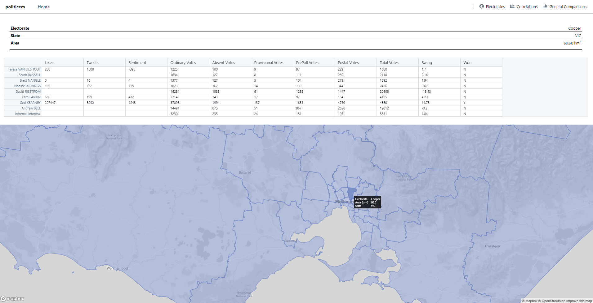
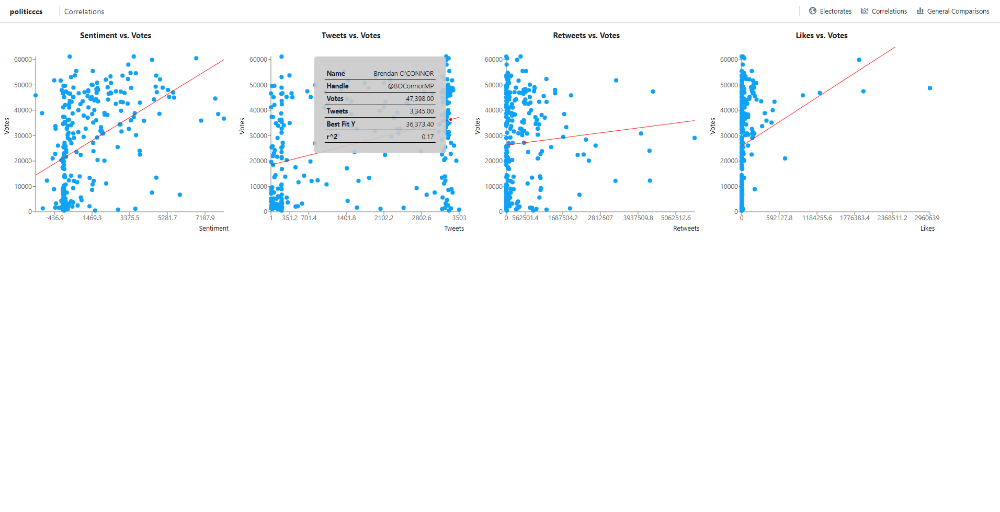
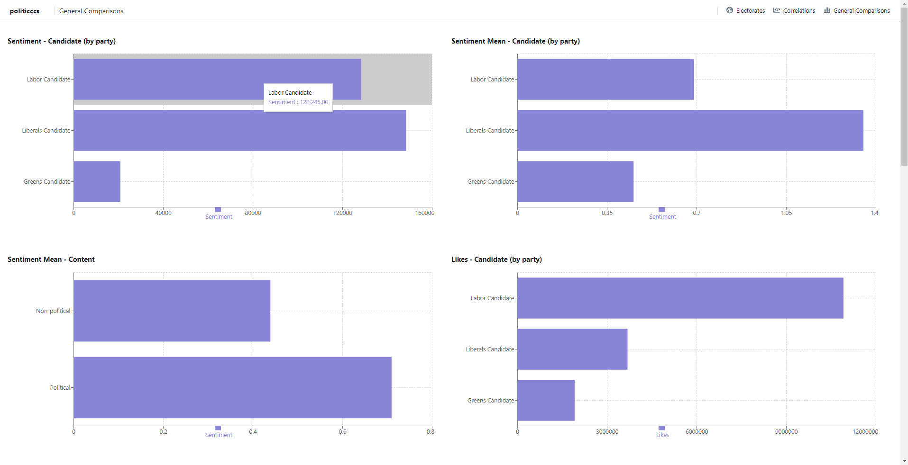

<!--
COMP90024 Cluster and Cloud Computing
Group 5
Aleksandar Pasquini (912504)
Amelia Fleischer-Boermans (389511)
Isaac Daly (1129173)
Mahardini Rizky Putri (921790)
Richard Yang (1215150)
-->

# politiCCCs frontend

This repository contains the frontend for politiCCCs.

**Electorates:**



**Correlations:**



**General comparisons:**



## Development

First, install all the dependencies:

```shell
npm install
```

To run the app in development mode, run:

```shell
npm start
```

This opens the app on [http://localhost:3000](http://localhost:3000) in your browser.

## Building

To build the app, run:

```shell
npm run build
```
